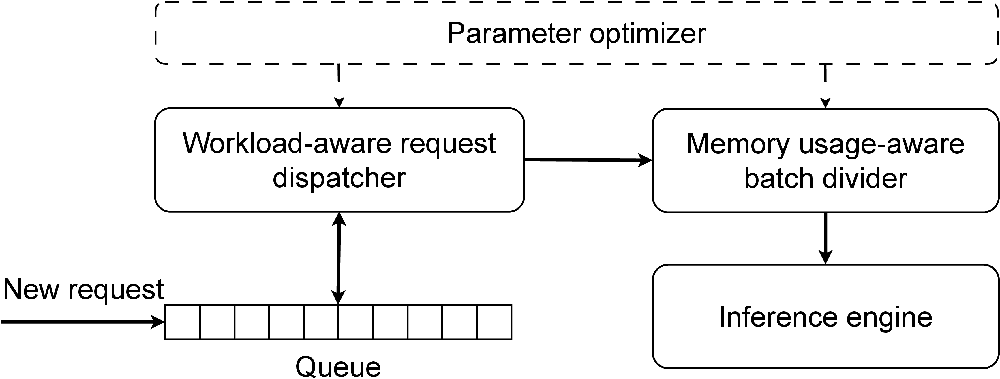
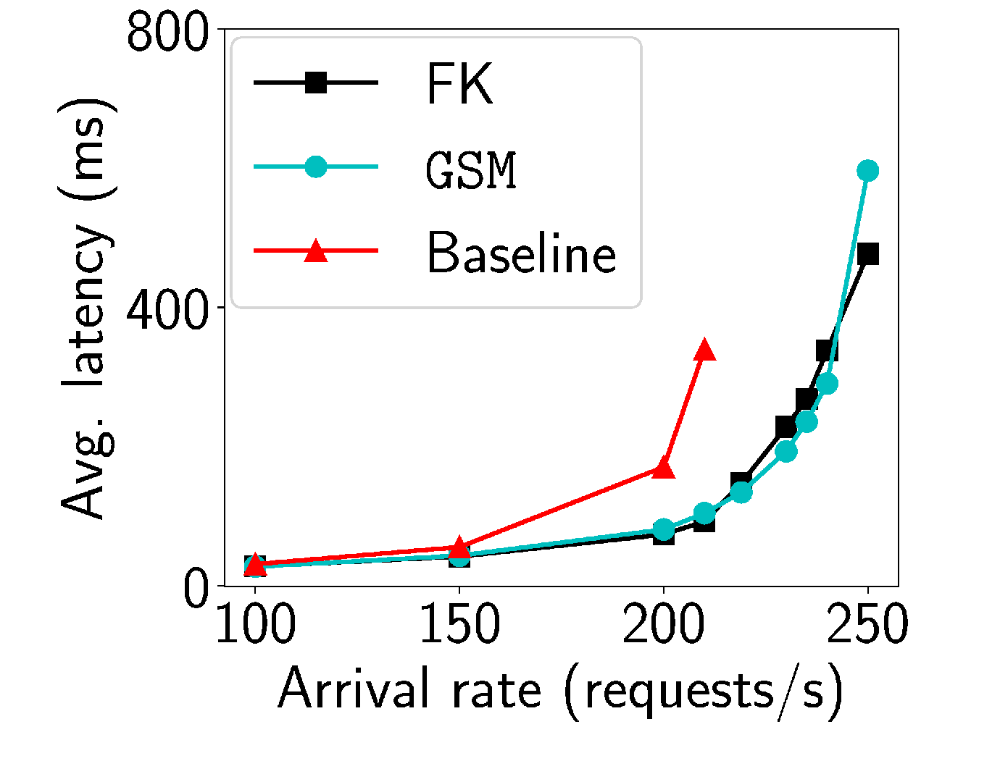
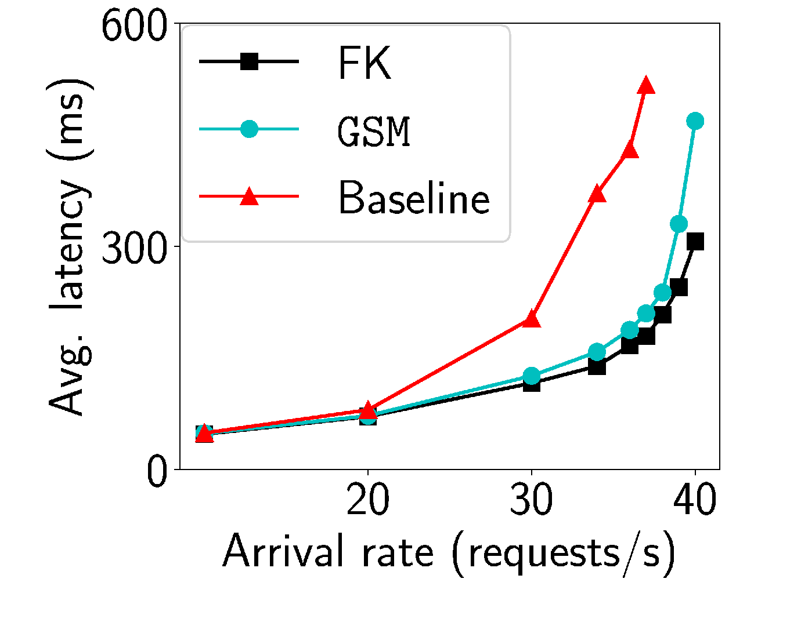
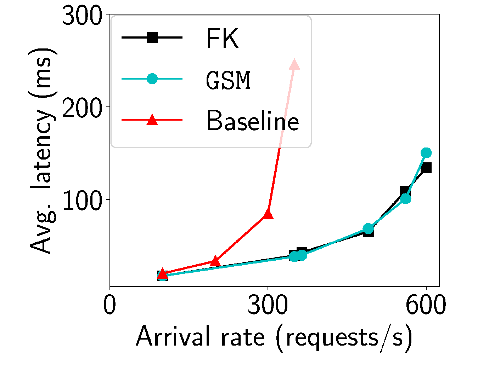
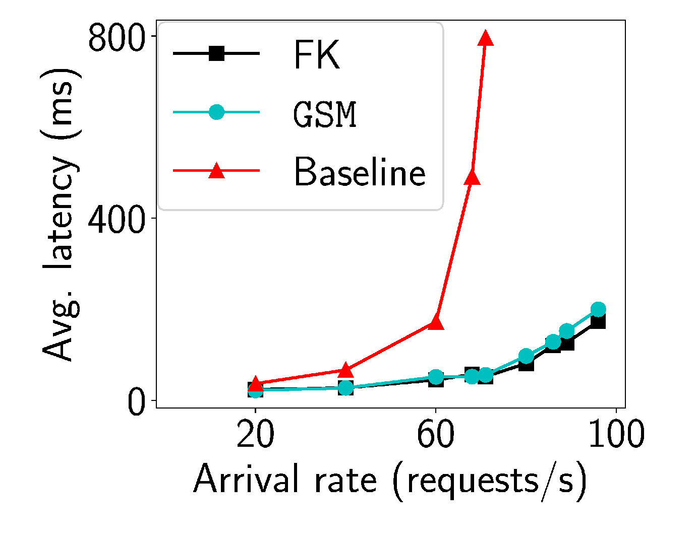
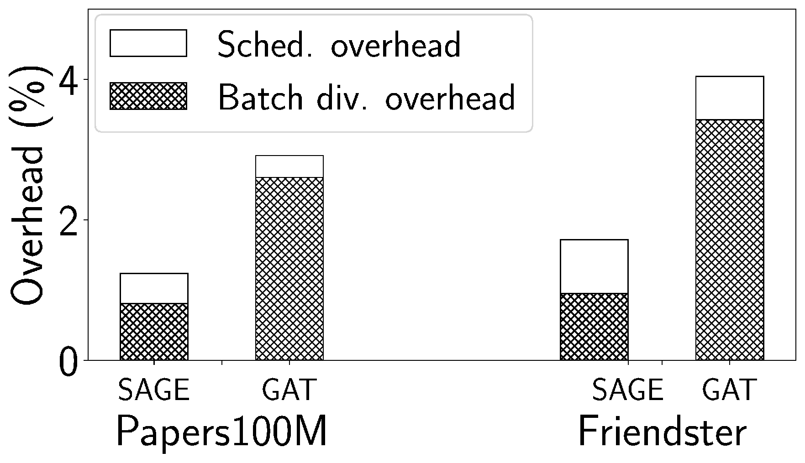

# GSM: Degree-Based Scheduling for Exact Online GNN Inference

This repository contains the artifact for **Degree-Based Scheduling and Memory Management for Large-Scale Exact Online GNN Inference**. GSM targets **exact online GNN inference**: serving per-vertex requests while processing all neighbors instead of using approximate neighbor sampling.

GSM reduces average request latency by combining:

- a degree-based scheduler that groups requests with similar predicted cost,
- a memory-aware batch divider that limits volatile batch subgraph sizes, and
- an offline parameter tuner for workload-specific in-degree and subgraph-size thresholds.

The DGL changes needed by GSM are included in [`DGL modifications`](DGL%20modifications). Apply them to a DGL checkout and build DGL from source before running the experiments.

## Paper

```bibtex
@inproceedings{namazi2025degree,
  title={Degree-Based Scheduling and Memory Management for Large-Scale Exact Online GNN Inference},
  author={Namazi, Alireza and Shen, Haiying and Sen, Tanmoy and Zhang, Minjia},
  booktitle={2025 IEEE International Conference on Big Data (BigData)},
  pages={1--10},
  year={2025},
  organization={IEEE}
}
```

## System Overview

GSM serves online requests from a queue, estimates request cost from target-vertex in-degree, dispatches degree-balanced batches, and divides oversized batch subgraphs before GPU inference. This keeps exact inference deterministic while reducing head-of-line blocking and stabilizing GPU memory usage.

<p align="center">
  
</p>

## Results From The Paper

The evaluation uses GraphSAGE and GAT on two billion-edge graphs, Papers100M and Friendster, on a single NVIDIA A100 40 GB GPU. Compared with the tuned DGL-based exact inference baseline, GSM reports:

| Metric | Papers100M GraphSAGE | Papers100M GAT | Friendster GraphSAGE | Friendster GAT |
| --- | ---: | ---: | ---: | ---: |
| Average latency reduction | up to 69% | up to 60% | up to 83% | up to 89% |
| Maximum throughput improvement | 20% | 8% | 71% | 35% |

The scheduler overhead is below 1% in all evaluated settings, and batch division overhead is 0.8-3.4%.

### End-To-End Latency

| Papers100M, GraphSAGE | Papers100M, GAT |
| --- | --- |
|  |  |

| Friendster, GraphSAGE | Friendster, GAT |
| --- | --- |
|  |  |

### Runtime Overhead

<p align="center">
  
</p>

The PNG figures above were converted from the EPS figures used in the paper.

## Repository Layout

| Path | Purpose |
| --- | --- |
| [`DGL modifications`](DGL%20modifications) | Patched DGL CUDA, array, sampling, and pin-memory files used by GSM. |
| [`dataset preprocessing`](dataset%20preprocessing) | Prepares Papers100M and Friendster graph artifacts. |
| [`e2e`](e2e) | End-to-end baseline, GSM, and full-knowledge comparison scripts. |
| [`experimental_analysis`](experimental_analysis) | Profiling scripts for batch processing, memory, and estimator analysis. |
| [`ablation_study`](ablation_study) | Scheduler and batch-divider ablation experiments. |
| [`sensitivity_analysis`](sensitivity_analysis) | Parameter-sensitivity experiments for in-degree and subgraph-size thresholds. |
| [`overhead`](overhead) | Scheduler and batch-division overhead measurement. |
| `find_pct_*.py`, `lin_*.py`, `*_load.py` | Helper scripts for workload profiling, parameter search, and request-load generation. |

Script suffixes follow the paper notation:

- `B`: DGL baseline
- `P`: proposed GSM method
- `O`: full-knowledge scheduler
- `M`, `S`: ablations
- `PA`: Papers100M
- `FR`: Friendster

## Environment

The paper experiments used:

- Python 3.10
- PyTorch 2.1.2
- DGL 2.2.x with the patches in this repository
- CUDA 12.2.2
- NVIDIA A100 40 GB GPU
- AMD EPYC 7742 CPU, 8 cores enabled, 300 GB RAM

Python packages used by the scripts include `torch`, `dgl`, `ogb`, `numpy`, `tqdm`, `pandas`, and `requests`. The exact DGL build is important because GSM relies on the patched sampler, pin-memory, and CUDA array operations.

## Apply The DGL Modifications

Clone DGL, then copy the patched files into the DGL source tree:

```bash
DGL_ROOT=/path/to/dgl
REPO_ROOT=/path/to/this/repo

git clone https://github.com/dmlc/dgl.git "$DGL_ROOT"
cd "$DGL_ROOT"
git checkout v2.2.1

cp "$REPO_ROOT/DGL modifications/array.cc"                    "$DGL_ROOT/src/array/array.cc"
cp "$REPO_ROOT/DGL modifications/array_index_select_uvm.cu"   "$DGL_ROOT/src/array/array_index_select_uvm.cu"
cp "$REPO_ROOT/DGL modifications/array_index_select_uvm.cuh"  "$DGL_ROOT/src/array/array_index_select_uvm.cuh"
cp "$REPO_ROOT/DGL modifications/uvm_array_op.h"              "$DGL_ROOT/src/array/uvm_array_op.h"
cp "$REPO_ROOT/DGL modifications/rowwise_sampling.cu"         "$DGL_ROOT/src/graph/sampling/rowwise_sampling.cu"
cp "$REPO_ROOT/DGL modifications/neighbor_sampler.py"         "$DGL_ROOT/python/dgl/sampling/neighbor_sampler.py"
cp "$REPO_ROOT/DGL modifications/pin_memory.py"               "$DGL_ROOT/python/dgl/sampling/pin_memory.py"
```

Build and install patched DGL:

```bash
cd "$DGL_ROOT"
mkdir -p build
cd build
cmake -DUSE_CUDA=ON ..
make -j"$(nproc 2>/dev/null || sysctl -n hw.ncpu)"
cd ..
pip install -e python
```

## Prepare Data

Large graph data and generated intermediate files are not stored in this repository.

Create a `dataset/` directory at the repository root, then generate or place the expected graph files:

```bash
mkdir -p dataset
```

For Papers100M, run the OGB preprocessing script and move the generated artifact into `dataset/`:

```bash
python "dataset preprocessing/pa.py"
mv PA.pkl dataset/PA.pkl
```

For Friendster, download `com-friendster.ungraph.txt.gz`, place it where the preprocessing script can read it, run:

```bash
python "dataset preprocessing/fpp.py"
mv friendster_dgl.bin dataset/friendster_dgl.bin
```

Several experiment scripts also expect generated request-load and tuning files such as `PA_load.pkl`, `FR_load.pkl`, `pcts_*`, and `cnds_*`. Generate them from the corresponding `*_load.py`, `find_pct_*`, and `lin_*` scripts before running end-to-end experiments.

## Running Experiments

The scripts are configured with constants near each `if __name__ == '__main__'` block. Edit those constants to choose the dataset, GNN model, arrival rate, number of requests, cache size, and tuned thresholds.

A typical workflow is:

```bash
# 1. Generate request-load metadata.
python PA_load.py
python FR_load.py

# 2. Profile subgraph-size distributions and candidate thresholds.
python find_pct_PA_B.py
python find_pct_PA_P.py
python find_pct_FR_B.py
python find_pct_FR_P.py

# 3. Run the tuner search.
python lin_PA_B.py
python lin_PA_P.py
python lin_FR_B.py
python lin_FR_P.py

# 4. Run end-to-end comparisons.
cd e2e
python PA_B.py
python PA_P.py
python PA_O.py
python FR_B.py
python FR_P.py
python FR_O.py
```

Experiment scripts launch local client/server processes and use `127.0.0.1:65432` by default. Make sure no other process is using that port.

## Notes

- GSM is exact: it does not reduce computation by random neighbor sampling.
- The figures and reported numbers in this README come from the paper's experimental setup.
- Reproducing the full evaluation requires large graph datasets and enough CPU/GPU memory for billion-edge inference.
- The repository is licensed under the MIT License.
